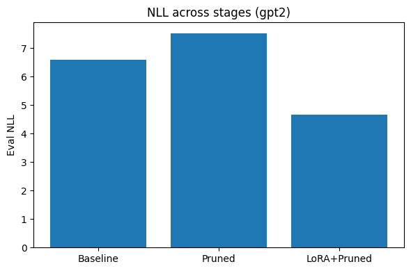
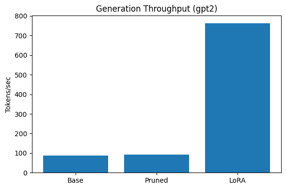
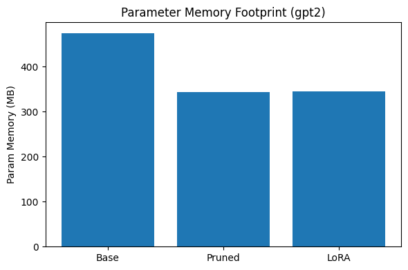

# Slimformers


Slimformers is a lightweight Python framework for pruning and fine-tuning transformer models. It supports activation-based MLP (FFN) pruning, attention head pruning, low-rank adaptation (LoRA) without needing any manual layer specification.

# Features

- Prunes neurons based on average activations across multiple batches
- Prunes attention heads based on mean query activations
- Automatic FFN and gated FFN block discovery for common architectures (GPT-2, BERT, LLaMA, OPT)
- Safely rebuilds pruned `nn.Linear` and `Conv1D` layers
- LoRA fine-tuning with auto-inferred target modules
- Compatible with Hugging Face models and tokenizers

# Quick Start

## Unified Pruning

```python
from slimformers import Pruner
from transformers import AutoModel, AutoTokenizer

# Load your model
model = AutoModel.from_pretrained("bert-base-uncased")
tokenizer = AutoTokenizer.from_pretrained("bert-base-uncased")

# Create pruner
pruner = Pruner(model)

# Prepare your DataLoader (dict with input_ids, attention_mask, etc.)
dataloader = your_dataloader_here

# Run pruning
pruner.prune(
    dataloader,
    strategy=["ffn", "attn"],
    sparsity=0.3,
    max_batches=10
)

# Individual overrides:
pruner.prune(
    dataloader,
    strategy=[
        ("ffn", {"sparsity": 0.4}),
        ("attn", {"sparsity": 0.2, "max_batches": 5}),
    ]
)
```

## Individual Methods (Advanced Use)

``` python
# FFN neuron pruning
pruner.prune_all_mlp_layers(
    dataloader=dataloader,
    sparsity=0.3,
    max_batches=10
)

# Attention head pruning
pruner.prune_attention_heads(
    dataloader=dataloader,
    sparsity=0.4,
    max_batches=10
)
```

## LoRA Fine-tuning, Optimizer options and Recipes
``` python
from slimformers import lora_finetune
from peft import TaskType

# Fine-tune with LoRA after pruning
fine_tuned_model = lora_finetune(
    model=model,
    dataloader=train_dataloader,
    epochs=3,
    lr=1e-4,
    device="cuda",
    r=8,
    alpha=16,
    task_type=TaskType.TOKEN_CLS
)
```

### Optimizer options & recipes

You can choose the optimizer via the ```optimizer``` arg and pass extra settings with ```optimizer_kwargs```.

Supported strings: ```"adamw"``` | ```"adam"``` | ```"sgd"``` (default: ```"adamw"```)

#### Quick recipes

**SGD with momentum + weight decay (Nesterov optional)**

``` python
fine_tuned_model = lora_finetune(
    model=model,
    dataloader=train_dataloader,
    epochs=3,
    lr=5e-4,
    device="cuda",
    r=8,
    alpha=16,
    task_type=TaskType.CAUSAL_LM,
    optimizer="sgd",
    optimizer_kwargs={
        "momentum": 0.9,
        "weight_decay": 1e-2,
        "nesterov": True,
    },
)
```

**AdamW with explicit decay + betas**

``` python 
fine_tuned_model = lora_finetune(
    model=model,
    dataloader=train_dataloader,
    epochs=3,
    lr=1e-4,
    device="cuda",
    r=8,
    alpha=16,
    task_type=TaskType.CAUSAL_LM,
    optimizer="adamw",
    optimizer_kwargs={
        "weight_decay": 1e-2,
        "betas": (0.9, 0.95),
        "eps": 1e-8,
    },
)
```

**Per parameter decay (no decay for bias/LayerNorm) with SGD momentum**

Use a **callable factory** so the optimizer is constructed on the PEFT params:

```python
def sgd_factory(params):
    no_decay = {"bias", "LayerNorm.weight", "layer_norm.weight"}
    grouped = [
        {"params": [p for n, p in model.named_parameters() if not any(nd in n for nd in no_decay)],
         "weight_decay": 1e-2},
        {"params": [p for n, p in model.named_parameters() if any(nd in n for nd in no_decay)],
         "weight_decay": 0.0},
    ]
    return torch.optim.SGD(grouped, lr=5e-4, momentum=0.9, nesterov=True)

fine_tuned_model = lora_finetune(
    model=model,
    dataloader=train_dataloader,
    epochs=3,
    lr=5e-4,
    device="cuda",
    r=8,
    alpha=16,
    task_type=TaskType.CAUSAL_LM,
    optimizer=sgd_factory,
)
```

> Note: If you pass a pre built ```torch.optim.Optimizer``` instance, it must be created after the model is PEFT-wrapped. Prefer using a string (```"sgd"```, ```"adamw"```, ```"adam"```) or a callable factory (as above), which Slimformers will invoke on the wrapped parameters.

## Custom Prune Strategy
``` python
def custom_neuron_selection(activations, sparsity):
    """Custom strategy: keep neurons with highest variance"""
    if activations.dim() == 3:
        variance = activations.var(dim=(0,1))
    elif activations.dim() == 2:
        variance = activations.var(dim=(0))
    elif activations.dim() == 1:
        variance = activations.var()
    else: 
        raise ValueError(f"Bad activation shape {activations.shape}")
    
    total = variance.size(0)
    k = int((1.0 - sparsity) * total)
    return torch.topk(variance, k=k).indices, total

# Use custom strategy
pruner = Pruner(model, pruning_strategy=custom_neuron_selection)
```

# CLI

Slimformers also provides a CLI for pruning Hugging Face models without writing Python code.

## Basic Usage

```bash
slimformers prune \
  --model gpt2 \
  --data ./data.txt \
  --ffn \
  --sparsity 0.3 \
  --save-to ./pruned-gpt2
```

### CLI Help

```text
usage: slimformers prune [-h] --model MODEL --data DATA [--batch-size BATCH_SIZE]
                         [--max-seq-len MAX_SEQ_LEN] [--num-workers NUM_WORKERS]
                         [--device DEVICE] [--dtype DTYPE] [--ffn] [--attention]
                         [--sparsity SPARSITY] [--sparsity-ffn SPARSITY_FFN]
                         [--sparsity-attn SPARSITY_ATTN] [--max-batches MAX_BATCHES]
                         [--save-to SAVE_TO] [--summary] [--verbose]

Prune a model (FFN and/or Attention)

options:
  --model MODEL                     HF model name or local path
  --data DATA                       Path to a text file (one example per line)
  --batch-size BATCH_SIZE           Batch size for data loading (default: 8)
  --max-seq-len MAX_SEQ_LEN         Max sequence length (default: 256)
  --num-workers NUM_WORKERS         Number of DataLoader workers
  --device DEVICE                   Target device (cpu, cuda, etc.)
  --dtype DTYPE                     Torch dtype: auto | fp32 | fp16 | bf16
  --ffn                             Enable FFN (MLP) pruning
  --attention                       Enable attention head pruning
  --sparsity SPARSITY               Default sparsity (default: 0.3)
  --sparsity-ffn SPARSITY_FFN       Override sparsity for FFN
  --sparsity-attn SPARSITY_ATTN     Override sparsity for Attention
  --max-batches MAX_BATCHES         Max batches for activation stats (default: 10)
  --save-to SAVE_TO                 Save pruned model
  --summary                         Print pruning summary
  --verbose                         Verbose logging
```

```bash
slimformers prune --help
```

## Benchmarks

| Model | Corpus | Method | Pruning&nbsp;(%) |   NLL   |   PPL   | Speed&nbsp;(tok/s) | Speedup&nbsp;(×) | Memory&nbsp;Saved&nbsp;(%) |
|:------|:-------|:-------|-----------------:|--------:|--------:|-------------------:|-----------------:|--------------------------:|
| gpt2  | WikiText-2 | Baseline | 0   | 6.594 |  731.02 |    87.70 | 1.00 | 0.0 |
| gpt2  | WikiText-2 | Pruning (structured) | 40  | 7.520 | 1845.34 |    92.52 | 1.06 | 27.7 |
| gpt2  | WikiText-2 | Pruning + LoRA<br>(fine-tuning) | 40  | 4.664 |  106.03 |   763.38 | 8.70 | 27.2 |
| deepseek-coder-1.3b-base | WikiText-2 | Baseline | 0   | 11.829 | 137159.36 |    31.87 | 1.00 | 0.0 |
| deepseek-coder-1.3b-base | WikiText-2 | Pruning (structured) | 40  | 15.260 | 4241601.01 |    38.98 | 1.22 | 37.2 |
| deepseek-coder-1.3b-base | WikiText-2 | Pruning + LoRA<br>(fine-tuning) | 40  | 11.913 | 149217.66 |    38.57 | 1.21 | 37.2 |

*Env: Linux&nbsp;| torch 2.6.0+cu124&nbsp;| device: cuda&nbsp;| max_length=128&nbsp;| batch=8*

### Performance Visualizations

Below are the visual comparisons for GPT-2 on WikiText-2 after 40% structured pruning and LoRA fine-tuning.

**Eval NLL Across Stages**



**Generation Throughput** *(tokens/sec)*



**Parameter Memory Footprint** *(MB)*



> **Notes:** 
>
> The tokens/sec value for *Pruning + LoRA* may be inflated because of a warm GPU state and cache. A consistent warmup and averaged eval is planned for future releases. 
>
> These results are from a very small model (GPT-2 small, ~124M parameters) on a limited dataset. Speedups, memory savings, and loss recovery may drastically differ for larger models and more complex corpora. Larger-scale experiments on models like LLaMA, Mistral, DeepSeek, Gemma are planned and will be added soon.

## Pruning Report

After pruning, ```pruner.report()``` displays a summary of the compression results. This includes:
- Original and pruned parameters counts
- Percentage reduction model size
- CPU and GPU memory usage before and after pruning
- Peak GPU memory usage (if CUDA enabled)

### Example 

Pruning was run on ```deepseek-ai/deepseek-coder-1.3b-base``` with 40% sparsity using a Lenovo ThinkPad T490 (Intel i5-8365U CPU, no GPU!): 
- Original Parameters: ```1,346,471,936```
- Pruned Parameters: ```1,024,855,424```
- Total Reduction: ```321,616,512 (23.89%)```
- CPU Memory: ```(Before --> After): 5398.57 MB --> 4253.34 MB (–1145.23 MB)```

# Limitations

Slimformers is made to be lightweight and architecture agnostic, but there are current limitations:

- **Model support is limited at this time**  
  Currently, attention head and FFN pruning supports GPT‑2, BERT, and LLaMA type models. Encoder-decoder architectures like T5 or BART (with cross-attention), and other variants like Falcon or BLOOM, are not supported yet. Also, FFN pruning assumes standard `nn.Linear` or `Conv1D` layers. If your model uses custom MLP designs like SwiGLU or fused blocks, you'll need to add custom discovery logic.

  That said, **support for more models will be added over time**. The framework is modular, and the discovery system is easy to extend. Feel free to contribute or fork it to add support for other architectures. I will continue to expand the library's coverage.

- **Won’t work with exotic attention layouts**  
  If your model uses grouped heads, custom fused QKV projections, or MoE-style head routing, the default slicing logic might fail. This is rare for most Hugging Face models, but possible.
